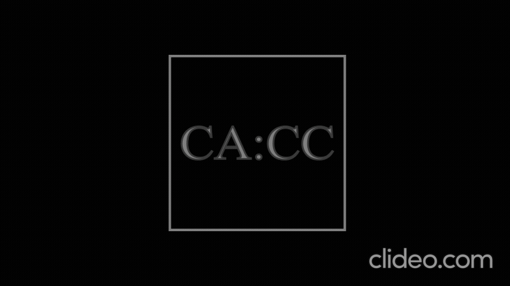

# Projeto de Conversor CA-CC

### Tópicos

- [Descrição do projeto](#descrição-do-projeto)
- [Etapas do Processo](#etapas-do-processo)
- [Transformadores](#transformadores)
- [Diodos e o Retificador de Ponte](#diodos-e-o-retificador-de-ponte)
- [Filtros](#filtros)
- [Conclusão](#conclusão)

## Descrição do Projeto

Os dispositivos elétricos e eletrônicos (computadores, geladeiras, etc.), os quais funcionam, em sua maioria, com corrente no regime contínuo, são indispensáveis no mundo moderno. Contudo, esse regime não é o ideal para fazer o transporte de energia elétrica por longas distâncias. Isso ocorre porque há a constante necessidade de usar amplificadores para manter níveis elevados de potência nas linhas de transmissão, já que muita energia se perde no caminho por Efeito Joule. Como isso é feito mais facilmente com corrente no regime alternado, ela é mais usada nessas linhas. Nesse sentido, foi desenvolvido o conversor Corrente Alternada-Corrente Contínua para permitir o uso da alta tensão que chega nas residências e empresas em suas necessidades.

## Etapas do Processo

✔️ `Etapa 1:` Diminuir a amplitude com o transformador.

✔️ `Etapa 2:` Fazer o processo de retificação com os diodos.

✔️ `Etapa 3:` Usar filtros para diminuir as ondulações restantes.

## Transformadores

É basicamente constituído de indutores e baseia-se no processo de indutância mútua, que é basicamente a geração de um campo elétrico em um indutor secundário, o que promove corrente elétrica, devido ao campo magnético variável produzido por una corrente em regime AC que passa pelo indutor primário, o que é consequência da Lei de Àmpere.

## Diodos e o Retificador de Ponte

## Filtros

Usando o Teorema da Superposição Linear, o sinal retificado pode ser decomposto nas partes apresentadas, e o filtro permitiria passar apenas a componente CC, que corresponde ao sinal de frequência nula, para uma carga resistiva, pois o indutor iria diminuir a amplitude da tensão que passa por ele até alcançar o valor médio, e o capacitor iria eliminar as componentes de alta frequência (idealmente toda a parte CA), deixando apenas a de frequência nula (parte CC)

## Conclusão

